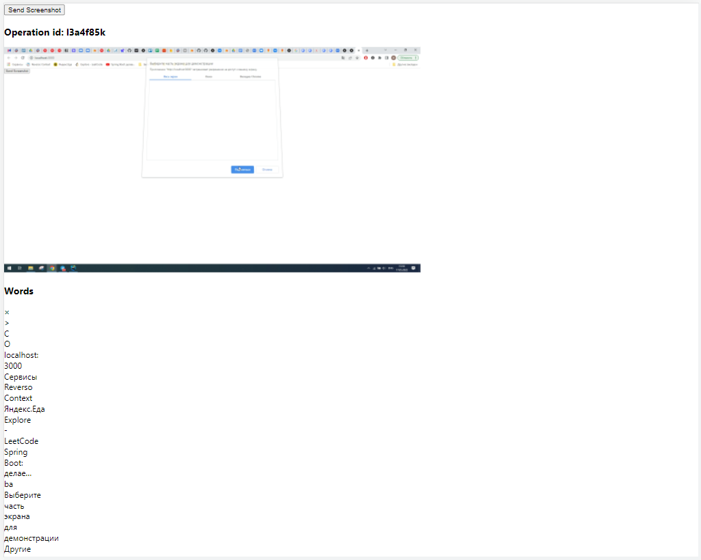

## Процесс

Делает скриншот выбранного окна.  
Отправляет скриншот на сервер.  
Сервер пересылает запрос на Yandex Vision.  
Сервер, получив ответ от Yandex Vision, возвращает на клинет id операции, сам скриншот, слова.
Клиент отрисовывает ответ с сервера.

## Запуск  

Так как токен живет 12 часов, то деплой на vercel превращается в тыкву.  

1. Склонировать репозиторий.
2. Прописать в env.local NEXT_PUBLIC_IAM_TOKEN и NEXT_PUBLIC_FOLDER.  
3. Скачать пакеты.  
4. npm run build, npm run start.  

## Результат  

